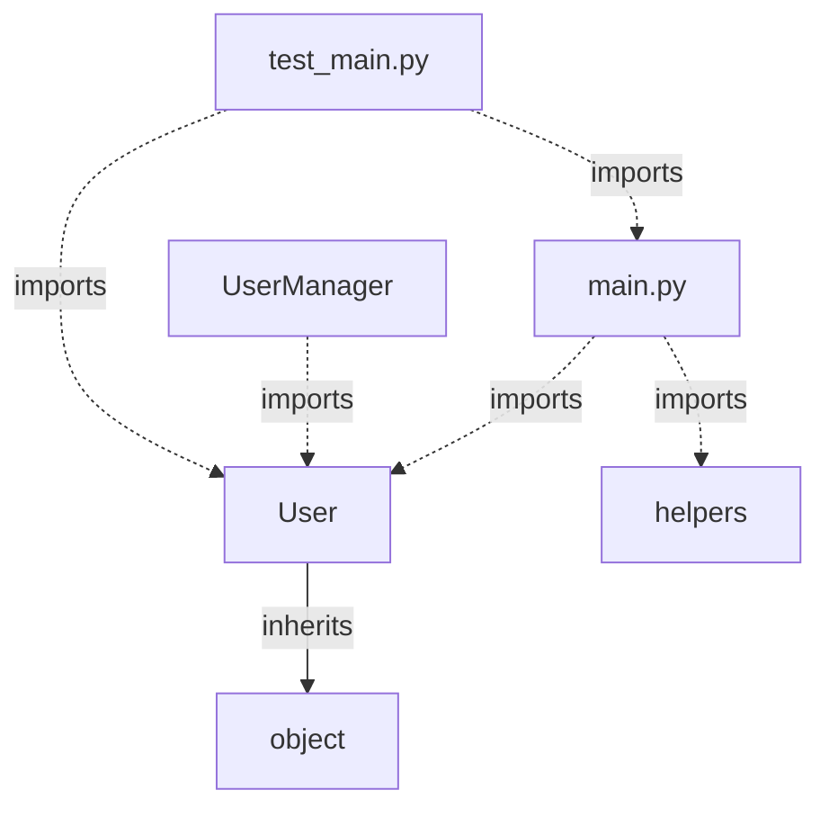

# example-repo - Code Documentation

*Generated on: 2024-11-04 15:30:45*

---

## 📖 Project Overview

This is an example Python repository showcasing the capabilities of Codebase Genius documentation system.

### 📊 Repository Statistics

- **Total Files**: 12
- **Python/Jac Modules**: 5
- **Classes**: 8
- **Functions**: 23

---

## 📁 File Structure

```
example-repo/
├── src/
│   ├── __init__.py
│   ├── main.py
│   ├── models/
│   │   ├── __init__.py
│   │   └── user.py
│   └── utils/
│       ├── __init__.py
│       └── helpers.py
├── tests/
│   ├── __init__.py
│   └── test_main.py
├── requirements.txt
└── README.md
```

---

## 🏗️ Code Structure

### Modules

#### `src/main.py`

**Classes:**
- `Application` - Methods: initialize, run, shutdown, handle_request, process_data

**Functions:**
- `main(args)`
- `setup_logging(level)`
- `load_config(config_path)`

#### `src/models/user.py`

**Classes:**
- `User` - Methods: __init__, save, delete, update, validate
- `UserManager` - Methods: create_user, get_user, list_users

**Functions:**
- `hash_password(password)`
- `verify_password(password, hash)`

#### `src/utils/helpers.py`

**Functions:**
- `format_date(date_obj)`
- `validate_email(email)`
- `generate_uuid()`
- `sanitize_input(text)`

---

## 🔗 Code Relationships



*Showing up to 20 key relationships from 15 total.*

---

## 📚 API Reference

### Classes

| Class | File | Methods |
|-------|------|---------|
| `Application` | src/main.py | 5 |
| `User` | src/models/user.py | 5 |
| `UserManager` | src/models/user.py | 3 |

### Functions

| Function | File | Parameters |
|----------|------|------------|
| `main` | src/main.py | args |
| `setup_logging` | src/main.py | level |
| `load_config` | src/main.py | config_path |
| `hash_password` | src/models/user.py | password |
| `verify_password` | src/models/user.py | password, hash |
| `format_date` | src/utils/helpers.py | date_obj |
| `validate_email` | src/utils/helpers.py | email |
| `generate_uuid` | src/utils/helpers.py | None |
| `sanitize_input` | src/utils/helpers.py | text |

---

## 🎯 Summary

This documentation was automatically generated by **Codebase Genius**, an agentic code documentation system. The analysis covered 5 modules, extracted 8 classes and 23 functions, and mapped 15 code relationships.

*For more details, please refer to the source code or contact the repository maintainers.*
