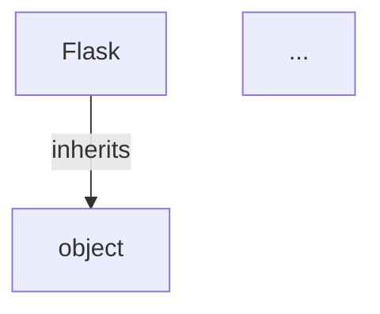

# 🧠 Codebase Genius

**AI-Powered Multi-Agent Code Documentation System**

Codebase Genius is an intelligent agentic system built with JacLang, FastAPI, and Streamlit that automatically analyzes GitHub repositories and generates comprehensive documentation.

---

## 🌟 Features

- **🤖 Multi-Agent Architecture**: Orchestrated workflow with specialized agents
  - **Code Genius (Supervisor)**: Central controller coordinating all operations
  - **Repo Mapper**: Clones and maps repository structure
  - **Code Analyzer**: Parses code and builds Code Context Graph (CCG)
  - **DocGenie**: Generates beautiful markdown documentation

- **🔍 Intelligent Analysis**
  - AST-based Python and Jac code parsing
  - Class, function, and module extraction
  - Dependency and relationship mapping
  - Entry point detection

- **📊 Rich Documentation**
  - Project overview with statistics
  - Interactive file tree visualization
  - Code structure breakdown
  - Mermaid diagrams for relationships
  - Comprehensive API reference

- **🎨 Modern UI**
  - Elegant dark theme with gradient accents
  - Real-time progress tracking
  - Chat-like analysis flow
  - History management
  - One-click documentation download

---

## 🏗️ Architecture

```
┌─────────────────────────────────────────────────────────┐
│                    User Interface                        │
│                 (Streamlit Frontend)                     │
└─────────────────────┬───────────────────────────────────┘
                      │ REST API
┌─────────────────────▼───────────────────────────────────┐
│                   FastAPI Server                         │
│              (API Gateway & Bridge)                      │
└─────────────────────┬───────────────────────────────────┘
                      │ Jac Calls
┌─────────────────────▼───────────────────────────────────┐
│                  JacLang Backend                         │
│            (Multi-Agent Orchestration)                   │
│                                                          │
│  ┌────────────┐  ┌─────────────┐  ┌───────────────┐   │
│  │Code Genius │→ │ Repo Mapper │→ │ Code Analyzer │   │
│  │(Supervisor)│  └─────────────┘  └───────────────┘   │
│  └────────────┘         │                  │           │
│        │                └──────────┬───────┘           │
│        │                           ▼                    │
│        │                   ┌──────────────┐            │
│        └──────────────────→│   DocGenie   │            │
│                            └──────────────┘            │
└────────────────────────────────────────────────────────┘
                      │
┌─────────────────────▼───────────────────────────────────┐
│              Python Helper Modules                       │
│   ┌──────────────┐  ┌───────────┐  ┌──────────────┐   │
│   │ repo_manager │  │parse_code │  │doc_generator │   │
│   └──────────────┘  └───────────┘  └──────────────┘   │
└──────────────────────────────────────────────────────────┘
```

---

## 📋 Prerequisites

- **Python**: 3.10 or higher
- **Git**: For repository cloning
- **JacLang**: Will be installed via pip

---

## 🚀 Installation & Setup

### 1. Clone the Repository

```bash
git clone <your-repo-url>
cd codebase-genius
```

### 2. Create Virtual Environment

```bash
python3 -m venv venv
source venv/bin/activate  # On Windows: venv\Scripts\activate
```

### 3. Install Dependencies

```bash
pip install --upgrade pip
pip install -r requirements.txt
```

### 4. Create Output Directory

```bash
mkdir -p outputs
```

---

## 🎯 Usage

### Option 1: Run Complete System (Recommended)

Open **three separate terminals** and run each command:

**Terminal 1 - Start FastAPI Server:**
```bash
source venv/bin/activate
uvicorn server:app --reload --port 8000
```

**Terminal 2 - Start Streamlit UI:**
```bash
source venv/bin/activate
streamlit run app.py
```

The application will open automatically in your browser at `http://localhost:8501`

### Option 2: API Only (No UI)

```bash
source venv/bin/activate
uvicorn server:app --reload --port 8000
```

Access API documentation at: `http://localhost:8000/docs`

---

## 🔌 API Endpoints

### `POST /analyze`
Analyze a GitHub repository

**Request:**
```json
{
  "repo_url": "https://github.com/username/repository"
}
```

**Response:**
```json
{
  "status": "success",
  "repo_name": "repository",
  "output_path": "outputs/repository/documentation.md",
  "generated_at": "2024-01-15T10:30:00"
}
```

### `GET /health`
Check API health status

### `GET /history`
Get list of analyzed repositories

### `GET /download/{repo_name}`
Download documentation file

### `GET /view/{repo_name}`
View documentation content as JSON

---

## 💻 Using the Web Interface

1. **Enter Repository URL**: Paste a GitHub URL in the input field
2. **Start Analysis**: Click "🔍 Analyze Repository"
3. **Watch Progress**: Real-time updates show analysis steps
4. **View Results**: Click "👁️ View Documentation" when complete
5. **Download**: Use "📥 Download Markdown" to save locally

### Example Repositories to Try

- `https://github.com/pallets/flask`
- `https://github.com/psf/requests`
- `https://github.com/django/django`
- Any public Python repository

---

## 📁 Project Structure

```
codebase-genius/
├── main.jac                 # Main JacLang implementation
├── server.py                # FastAPI server
├── app.py                   # Streamlit frontend
├── requirements.txt         # Python dependencies
├── README.md               # This file
│
├── py_helpers/             # Python helper modules
│   ├── __init__.py
│   ├── repo_manager.py     # Git operations
│   ├── parse_code.py       # AST parsing
│   └── doc_generator.py    # Markdown generation
│
└── outputs/                # Generated documentation
    └── <repo_name>/
        └── documentation.md
```

---

## 🧪 Testing

### Test API Health
```bash
curl http://localhost:8000/health
```

### Test Analysis (CLI)
```bash
curl -X POST http://localhost:8000/analyze \
  -H "Content-Type: application/json" \
  -d '{"repo_url":"https://github.com/pallets/flask"}'
```

### Run Jac Walker Directly
```bash
jac run main.jac -w HealthCheck
```

---

## 📊 Generated Documentation Features

Each generated documentation includes:

- **📖 Project Overview**: README summary and statistics
- **📁 File Structure**: ASCII tree visualization
- **🏗️ Code Structure**: Modules, classes, and functions
- **🔗 Relationships**: Mermaid diagrams showing dependencies
- **📚 API Reference**: Comprehensive tables of code elements

---

## 🛠️ Configuration

### Environment Variables

Create a `.env` file (optional):

```bash
API_URL=http://localhost:8000
WORKSPACE_DIR=/tmp/codebase_genius
OUTPUT_DIR=outputs
```

### Adjust Timeouts

In `server.py`, modify timeout values:
```python
timeout=600  # 10 minutes for large repos
```

---

## 🐛 Troubleshooting

### "Module 'jaclang' not found"
```bash
pip install --upgrade jaclang
```

### "Backend Offline" in UI
Ensure FastAPI server is running:
```bash
uvicorn server:app --reload --port 8000
```

### Git Clone Fails
- Check repository URL is correct and public
- Ensure Git is installed: `git --version`
- Check network connectivity

### Analysis Takes Too Long
- Large repositories may take 5-10 minutes
- Check terminal for progress logs
- Consider analyzing smaller repos first

---

## 🔮 Advanced Features (Optional)

### Add LLM Integration

Uncomment in `requirements.txt`:
```bash
openai>=1.0.0
anthropic>=0.7.0
```

Add to `doc_generator.py`:
```python
# Use LLM to enhance summaries
summary = llm_summarize(readme_content)
```

### Enable Tree-sitter

For more advanced parsing:
```bash
pip install tree-sitter tree-sitter-python
```

---

## 📝 Example Output

Here's a sample of generated documentation structure:

```markdown
# flask - Code Documentation

*Generated on: 2024-01-15 10:30:00*

## 📖 Project Overview
Flask is a lightweight WSGI web application framework...

## 📊 Repository Statistics
- **Total Files**: 156
- **Python/Jac Modules**: 45
- **Classes**: 89
- **Functions**: 234

## 📁 File Structure
flask/
├── src/
│   └── flask/
│       ├── app.py
│       └── ...
└── ...

## 🔗 Code Relationships

```

---

## 🤝 Contributing

This is an academic assignment project. For improvements:

1. Fork the repository
2. Create a feature branch
3. Submit a pull request with detailed description

---

## 📄 License

This project is created for educational purposes as part of an academic assignment.

---

## 🙏 Acknowledgments

- **JacLang** - For the powerful agent-oriented programming paradigm
- **FastAPI** - For the robust API framework
- **Streamlit** - For the elegant UI framework
- **Jaseci Labs** - For inspiration from the byLLM example

---

## 📧 Support

For issues or questions:
1. Check the troubleshooting section
2. Review terminal logs for errors
3. Ensure all dependencies are installed
4. Verify Git and Python versions

---

## 🎓 Assignment Details

**Course**: Advanced AI Systems  
**Project**: Codebase Genius - Agentic Code-Documentation System  
**Tech Stack**: JacLang + FastAPI + Streamlit  
**Architecture**: Multi-Agent System with CCG (Code Context Graph)

---

**Built with ❤️ using JacLang Multi-Agent Architecture**
