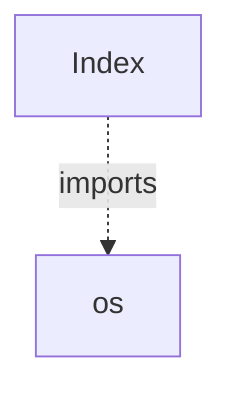

# WIFI-HACKING - Code Documentation

*Generated on: 2025-11-05 00:22:26*

---

## 📖 Project Overview


<p>
<p align="center">
  &nbsp;
  &nbsp;
 <img src="https...

### 📊 Repository Statistics

- **Total Files**: 12
- **Python/Jac Modules**: 2
- **Classes**: 0
- **Functions**: 0

---

## 📁 File Structure

```
WIFI-HACKING/
├── IMAGE
│   ├── carbon.png
│   ├── demo1.png
│   ├── demo2.png
│   ├── demo3.png
│   ├── demo4.png
│   ├── demo5.jpg
│   ├── demo6.jpg
│   └── demo7.jpg
├── Index.py
├── LICENSE
├── README.md
└── WIFI.py
```

---

## 🏗️ Code Structure

### Modules

#### `Index.py`

#### `WIFI.py`

*Parse error: Syntax error: source code string cannot contain null bytes*

---

## 🔗 Code Relationships



*Showing up to 20 key relationships from 1 total.*

---

## 📚 API Reference

---

## 🎯 Summary

This documentation was automatically generated by **Codebase Genius**, an agentic code documentation system. The analysis covered 2 modules, extracted 0 classes and 0 functions, and mapped 1 code relationships.

*For more details, please refer to the source code or contact the repository maintainers.*