# jac-techguide-bot - Code Documentation

*Generated on: 2025-11-04 22:15:45*

---

## 📖 Project Overview


# 🤖 TechGuide Bot - AI-Powered Programming Language Advisor

[](https://jaclang.org)
[](https://fastapi.tiangolo.com)
[](https://streamlit.io)
[](https://python.org)
[](LICENSE)

> A...

### 📊 Repository Statistics

- **Total Files**: 19
- **Python/Jac Modules**: 9
- **Classes**: 5
- **Functions**: 9

---

## 📁 File Structure

```
jac-techguide-bot/
├── .streamlit
│   ├── config.toml
│   └── secrets.toml
├── README.md
├── README_ADVANCED.md
├── README_API.md
├── TOOLKIT.md
├── backend
│   ├── Dockerfile
│   ├── ai_helper.py
│   ├── jac_modules
│   │   ├── main_api.jac
│   │   ├── nodes.jac
│   │   ├── session_manager.jac
│   │   └── walkers.jac
│   ├── requirements.txt
│   └── server.py
├── classifier.py
├── docs
│   └── TOOLKIT.md
└── frontend
    ├── app.py
    ├── config.py
    └── requirements.txt
```

---

## 🏗️ Code Structure

### Modules

#### `backend/ai_helper.py`

**Classes:**
- `AIHelper` - Methods: __init__, is_enabled, chat, classify_interest

**Functions:**
- `chat_with_ai(message, context)`
- `classify_with_ai(text)`

#### `backend/jac_modules/main_api.jac`

*Parse error: Syntax error: invalid syntax (<unknown>, line 8)*

#### `backend/jac_modules/nodes.jac`

*Parse error: Syntax error: invalid syntax (<unknown>, line 8)*

#### `backend/jac_modules/session_manager.jac`

*Parse error: Syntax error: invalid syntax (<unknown>, line 6)*

#### `backend/jac_modules/walkers.jac`

*Parse error: Syntax error: invalid syntax (<unknown>, line 5)*

#### `backend/server.py`

**Classes:**
- `ChatRequest` - Methods: None
- `TechGuideRequest` - Methods: None
- `EnhancedBackend` - Methods: process_chat, classify_and_recommend, get_recommendation

#### `classifier.py`

**Classes:**
- `InterestClassifier` - Methods: __init__, classify

#### `frontend/app.py`

**Functions:**
- `check_backend_health()`
- `send_chat_message(message)`
- `use_fallback_logic(message)`
- `display_learning_path(learning_path)`
- `display_resources(resources)`
- *... and 2 more*

#### `frontend/config.py`

---

## 🔗 Code Relationships

```mermaid
graph TD
    classifier[classifier] -.->|imports| Dict[Dict]
    classifier[classifier] -.->|imports| Tuple[Tuple]
    classifier[classifier] -.->|imports| re[re]
    config[config] -.->|imports| os[os]
    app[app] -.->|imports| streamlit[streamlit]
    app[app] -.->|imports| requests[requests]
    app[app] -.->|imports| Dict[Dict]
    app[app] -.->|imports| Any[Any]
    app[app] -.->|imports| datetime[datetime]
    app[app] -.->|imports| time[time]
    app[app] -.->|imports| os[os]
    app[app] -.->|imports| uuid[uuid]
    ai_helper[ai_helper] -.->|imports| os[os]
    ai_helper[ai_helper] -.->|imports| logging[logging]
    ai_helper[ai_helper] -.->|imports| Dict[Dict]
    ai_helper[ai_helper] -.->|imports| Any[Any]
    ai_helper[ai_helper] -.->|imports| Optional[Optional]
    ai_helper[ai_helper] -.->|imports| json[json]
    ai_helper[ai_helper] -.->|imports| generativeai[generativeai]
    ChatRequest[ChatRequest] -->|inherits| BaseModel[BaseModel]
```



*Showing up to 20 key relationships from 41 total.*

---

## 📚 API Reference

### Classes

| Class | File | Methods |
|-------|------|---------|
| `AIHelper` | backend/ai_helper.py | 4 |
| `ChatRequest` | backend/server.py | 0 |
| `EnhancedBackend` | backend/server.py | 3 |
| `TechGuideRequest` | backend/server.py | 0 |
| `InterestClassifier` | classifier.py | 2 |

### Functions

| Function | File | Parameters |
|----------|------|------------|
| `chat_with_ai` | backend/ai_helper.py | message, context |
| `classify_with_ai` | backend/ai_helper.py | text |
| `check_backend_health` | frontend/app.py | None |
| `display_career_paths` | frontend/app.py | career_paths |
| `display_learning_path` | frontend/app.py | learning_path |
| `display_recommendation` | frontend/app.py | result |
| `display_resources` | frontend/app.py | resources |
| `send_chat_message` | frontend/app.py | message |
| `use_fallback_logic` | frontend/app.py | message |

---

## 🎯 Summary

This documentation was automatically generated by **Codebase Genius**, an agentic code documentation system. The analysis covered 9 modules, extracted 5 classes and 9 functions, and mapped 41 code relationships.

*For more details, please refer to the source code or contact the repository maintainers.*