# requests - Code Documentation

*Generated on: 2025-11-04 22:24:23*

---

## 📖 Project Overview

# Requests

**Requests** is a simple, yet elegant, HTTP library.

```python
>>> import requests
>>> r = requests.get('https://httpbin.org/basic-auth/user/pass', auth=('user', 'pass'))
>>> r.status_code
200
>>> r.headers['content-type']
'application/json; charset=utf8'
>>> r.encoding
'utf-8'
>>> r.text
'{"authenticated": true, ...'
>>> r.json()
{'authenticated': True, ...}
```

Requests allows you to send HTTP/1.1 requests extremely easily. There’s no need to manually add query strings to your UR...

### 📊 Repository Statistics

- **Total Files**: 138
- **Python/Jac Modules**: 36
- **Classes**: 56
- **Functions**: 87

---

## 📁 File Structure

```
requests/
├── .coveragerc
├── .git-blame-ignore-revs
├── .github
│   ├── CODE_OF_CONDUCT.md
│   ├── CONTRIBUTING.md
│   ├── FUNDING.yml
│   ├── ISSUE_TEMPLATE
│   │   ├── Bug_report.md
│   │   ├── Custom.md
│   │   └── Feature_request.md
│   ├── ISSUE_TEMPLATE.md
│   ├── SECURITY.md
│   ├── dependabot.yml
│   └── workflows
│       ├── close-issues.yml
│       ├── codeql-analysis.yml
│       ├── lint.yml
│       ├── lock-issues.yml
│       ├── publish.yml
│       └── run-tests.yml
├── .pre-commit-config.yaml
├── .readthedocs.yaml
├── AUTHORS.rst
├── HISTORY.md
├── LICENSE
├── MANIFEST.in
├── Makefile
├── NOTICE
├── README.md
├── docs
│   ├── .nojekyll
│   ├── Makefile
│   ├── _static
│   │   ├── custom.css
│   │   └── requests-sidebar.png
│   ├── _templates
│   │   ├── hacks.html
│   │   ├── sidebarintro.html
│   │   └── sidebarlogo.html
│   ├── _themes
│   │   ├── LICENSE
│   │   └── flask_theme_support.py
│   ├── api.rst
│   ├── community
│   │   ├── faq.rst
│   │   ├── out-there.rst
│   │   ├── recommended.rst
│   │   ├── release-process.rst
│   │   ├── support.rst
│   │   ├── updates.rst
│   │   └── vulnerabilities.rst
│   ├── conf.py
│   ├── dev
│   │   ├── authors.rst
│   │   └── contributing.rst
│   ├── index.rst
│   ├── make.bat
│   ├── requirements.txt
│   └── user
│       ├── advanced.rst
│       ├── authentication.rst
│       ├── install.rst
│       └── quickstart.rst
├── ext
│   ├── LICENSE
│   ├── flower-of-life.jpg
│   ├── kr-compressed.png
│   ├── kr.png
│   ├── psf-compressed.png
│   ├── psf.png
│   ├── requests-logo-compressed.png
│   ├── requests-logo.ai
│   ├── requests-logo.png
│   ├── requests-logo.svg
│   ├── ss-compressed.png
│   └── ss.png
├── pyproject.toml
├── requirements-dev.txt
├── setup.cfg
├── setup.py
├── src
│   └── requests
│       ├── __init__.py
│       ├── __version__.py
│       ├── _internal_utils.py
│       ├── adapters.py
│       ├── api.py
│       ├── auth.py
│       ├── certs.py
│       ├── compat.py
│       ├── cookies.py
│       ├── exceptions.py
│       ├── help.py
│       ├── hooks.py
│       ├── models.py
│       ├── packages.py
│       ├── sessions.py
│       ├── status_codes.py
│       ├── structures.py
│       └── utils.py
├── tests
│   ├── __init__.py
│   ├── certs
│   │   ├── README.md
│   │   ├── expired
│   │   │   ├── Makefile
│   │   │   ├── README.md
│   │   │   ├── ca
│   │   │   │   ├── Makefile
│   │   │   │   ├── ca-private.key
│   │   │   │   ├── ca.cnf
│   │   │   │   ├── ca.crt
│   │   │   │   └── ca.srl
│   │   │   └── server
│   │   │       ├── Makefile
│   │   │       ├── cert.cnf
│   │   │       ├── server.csr
│   │   │       ├── server.key
│   │   │       └── server.pem
│   │   ├── mtls
│   │   │   ├── Makefile
│   │   │   ├── README.md
│   │   │   └── client
│   │   │       ├── Makefile
│   │   │       ├── ca
│   │   │       │   ├── Makefile
│   │   │       │   ├── ca-private.key
│   │   │       │   ├── ca.cnf
│   │   │       │   ├── ca.crt
│   │   │       │   └── ca.srl
│   │   │       ├── cert.cnf
│   │   │       ├── client.csr
│   │   │       ├── client.key
│   │   │       └── client.pem
│   │   └── valid
│   │       ├── ca
│   │       │   ├── Makefile
│   │       │   ├── ca-private.key
│   │       │   ├── ca.cnf
│   │       │   ├── ca.crt
│   │       │   └── ca.srl
│   │       └── server
│   │           ├── Makefile
│   │           ├── cert.cnf
│   │           ├── server.csr
│   │           ├── server.key
│   │           └── server.pem
│   ├── compat.py
│   ├── conftest.py
│   ├── test_adapters.py
│   ├── test_help.py
│   ├── test_hooks.py
│   ├── test_lowlevel.py
│   ├── test_packages.py
│   ├── test_requests.py
│   ├── test_structures.py
│   ├── test_testserver.py
│   ├── test_utils.py
│   ├── testserver
│   │   ├── __init__.py
│   │   └── server.py
│   └── utils.py
└── tox.ini
```

---

## 🏗️ Code Structure

### Modules

#### `docs/_themes/flask_theme_support.py`

**Classes:**
- `FlaskyStyle` - Methods: None

#### `docs/conf.py`

#### `setup.py`

#### `src/requests/__init__.py`

**Functions:**
- `check_compatibility(urllib3_version, chardet_version, charset_normalizer_version)`
- `_check_cryptography(cryptography_version)`

#### `src/requests/__version__.py`

#### `src/requests/_internal_utils.py`

**Functions:**
- `to_native_string(string, encoding)`
- `unicode_is_ascii(u_string)`

#### `src/requests/adapters.py`

**Classes:**
- `BaseAdapter` - Methods: __init__, send, close
- `HTTPAdapter` - Methods: __init__, __getstate__, __setstate__, init_poolmanager, proxy_manager_for, ...

**Functions:**
- `_urllib3_request_context(request, verify, client_cert, poolmanager)`
- `SOCKSProxyManager()`

#### `src/requests/api.py`

**Functions:**
- `request(method, url)`
- `get(url, params)`
- `options(url)`
- `head(url)`
- `post(url, data, json)`
- *... and 3 more*

#### `src/requests/auth.py`

*Parse error: Parse error: argument of type 'Call' is not iterable*

#### `src/requests/certs.py`

---

## 🔗 Code Relationships

```mermaid
graph TD
    setup[setup] -.->|imports| os[os]
    setup[setup] -.->|imports| sys[sys]
    setup[setup] -.->|imports| open[open]
    setup[setup] -.->|imports| setup[setup]
    conf[conf] -.->|imports| sys[sys]
    conf[conf] -.->|imports| os[os]
    conf[conf] -.->|imports| requests[requests]
    FlaskyStyle[FlaskyStyle] -->|inherits| Style[Style]
    flask_theme_support[flask_theme_support] -.->|imports| Style[Style]
    flask_theme_support[flask_theme_support] -.->|imports| Keyword[Keyword]
    flask_theme_support[flask_theme_support] -.->|imports| Name[Name]
    flask_theme_support[flask_theme_support] -.->|imports| Comment[Comment]
    flask_theme_support[flask_theme_support] -.->|imports| String[String]
    flask_theme_support[flask_theme_support] -.->|imports| Error[Error]
    flask_theme_support[flask_theme_support] -.->|imports| Number[Number]
    flask_theme_support[flask_theme_support] -.->|imports| Operator[Operator]
    flask_theme_support[flask_theme_support] -.->|imports| Generic[Generic]
    flask_theme_support[flask_theme_support] -.->|imports| Whitespace[Whitespace]
    flask_theme_support[flask_theme_support] -.->|imports| Punctuation[Punctuation]
    flask_theme_support[flask_theme_support] -.->|imports| Other[Other]
```



*Showing up to 20 key relationships from 294 total.*

---

## 📚 API Reference

### Classes

| Class | File | Methods |
|-------|------|---------|
| `FlaskyStyle` | docs/_themes/flask_theme_support.py | 0 |
| `BaseAdapter` | src/requests/adapters.py | 3 |
| `HTTPAdapter` | src/requests/adapters.py | 15 |
| `CookieConflictError` | src/requests/cookies.py | 0 |
| `MockRequest` | src/requests/cookies.py | 14 |
| `MockResponse` | src/requests/cookies.py | 3 |
| `RequestsCookieJar` | src/requests/cookies.py | 24 |
| `ChunkedEncodingError` | src/requests/exceptions.py | 0 |
| `ConnectTimeout` | src/requests/exceptions.py | 0 |
| `ConnectionError` | src/requests/exceptions.py | 0 |
| `ContentDecodingError` | src/requests/exceptions.py | 0 |
| `FileModeWarning` | src/requests/exceptions.py | 0 |
| `HTTPError` | src/requests/exceptions.py | 0 |
| `InvalidHeader` | src/requests/exceptions.py | 0 |
| `InvalidJSONError` | src/requests/exceptions.py | 0 |
| `InvalidProxyURL` | src/requests/exceptions.py | 0 |
| `InvalidSchema` | src/requests/exceptions.py | 0 |
| `InvalidURL` | src/requests/exceptions.py | 0 |
| `JSONDecodeError` | src/requests/exceptions.py | 2 |
| `MissingSchema` | src/requests/exceptions.py | 0 |
| ... | ... | *36 more* |

### Functions

| Function | File | Parameters |
|----------|------|------------|
| `_check_cryptography` | src/requests/__init__.py | cryptography_version |
| `check_compatibility` | src/requests/__init__.py | urllib3_version, chardet_version, charset_normalizer_version |
| `to_native_string` | src/requests/_internal_utils.py | string, encoding |
| `unicode_is_ascii` | src/requests/_internal_utils.py | u_string |
| `SOCKSProxyManager` | src/requests/adapters.py | None |
| `_urllib3_request_context` | src/requests/adapters.py | request, verify, client_cert, ... |
| `delete` | src/requests/api.py | url |
| `get` | src/requests/api.py | url, params |
| `head` | src/requests/api.py | url |
| `options` | src/requests/api.py | url |
| `patch` | src/requests/api.py | url, data |
| `post` | src/requests/api.py | url, data, json |
| `put` | src/requests/api.py | url, data |
| `request` | src/requests/api.py | method, url |
| `_resolve_char_detection` | src/requests/compat.py | None |
| `_copy_cookie_jar` | src/requests/cookies.py | jar |
| `cookiejar_from_dict` | src/requests/cookies.py | cookie_dict, cookiejar, overwrite |
| `create_cookie` | src/requests/cookies.py | name, value |
| `extract_cookies_to_jar` | src/requests/cookies.py | jar, request, response |
| `get_cookie_header` | src/requests/cookies.py | jar, request |
| ... | ... | *67 more* |

---

## 🎯 Summary

This documentation was automatically generated by **Codebase Genius**, an agentic code documentation system. The analysis covered 36 modules, extracted 56 classes and 87 functions, and mapped 294 code relationships.

*For more details, please refer to the source code or contact the repository maintainers.*